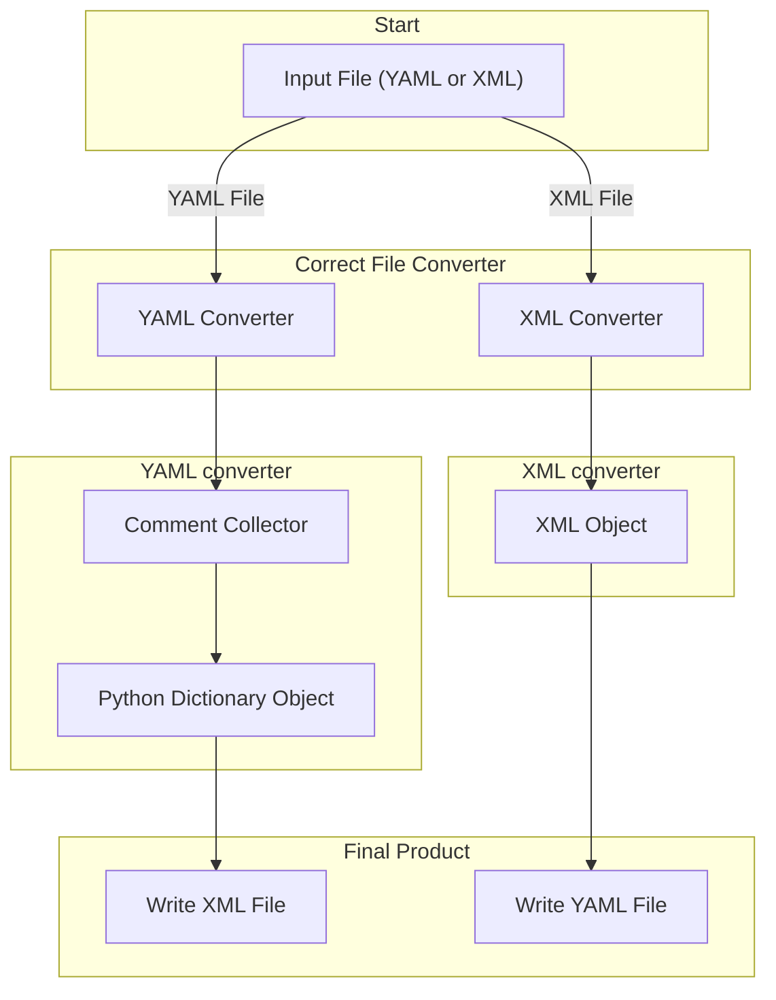

# nyaml

## Scope and purpose:
## may edit again
Make working with the NeXus Schema Definition Language more convenient for end users.
NeXus and its respective NeXus Definition Language (NXDL) represents a concerted effort for standardizing the terminology and granularization for the exchange of serialized data and metadata within and across scientific communities. NeXus is rooted in the neutron, X-ray, and muon research [J. Appl. Cryst. (2015). 48, 301-305](https://doi.org/10.1107/S1600576714027575). The tool nyaml is an effort of members of the solid-state physics community within the German National Research Data Infrastructure ([German NFDI](https://www.github.com/FAIRmat-NFDI) to extend NeXus for standardized information exchange in the research fields of materials characterization.

NeXus describes concepts through general data storage objects (so-called base classes). From these building blocks, a so-called application definition is composed. This is a measurement- and instrument-specific graph that can be used to define which pieces of information are communicated with instance data such as files or database artifacts. Base classes and application definitions are defined through a so-called NXDL schema definition file using the Extensible Markup Language, [XML](https://www.w3.org/TR/REC-xml/REC-xml-20081126.xml). The nyaml tool makes the process of working and editing NXDL schema definitions more efficient by using Yet Another Markup Language ([YAML](https://yaml.org/) with its indentation-driven approach to eliminate the need for editing starting and ending XML tags. Thereby, the schema definitions read more concisely and enable grasping more intuitively class inheritance that NeXus allows for. 

The [nyaml](https://github.com/FAIRmat-NFDI/nyaml/tree/main) Python package serves as a tool for bidirectional converting between the `YAML` and `XML` expressed NXDL data schemas. 
This `README.md` documents the specific simplified set of notation whereby users can write base class schemas or application definition schemas using `YAML`. Noteworthy, this `README.md` does not introduce the capabilities of the NeXus Definition Language (specifically its NeXus objects, terms, or types). Please refer to the official NeXus documentation at NeXus [official site](https://www.nexusformat.org/).

## Table of contents
1. [Introduction](#introduction)
2. [Getting started with nyaml](#how-to-use-nyaml-tool)
3. [Workflow](#nyaml-workflow)
4. [How to use nyaml](#how-to-use-nyaml-tool)
5. [Conversion from YAML to XML](#conversion-from-yaml-to-xml)
6. [Design of NeXusOntology and terms in YAML](#design-of-nexus-dataformat-and-terms-in-yaml)
   - [NeXus root section for base classes and application definitions](#root-section-for-base-classes-and-application-definitions)
   - [NeXus group](#nexus-group)
   - [NeXus field and NeXus attribute](#nexus-field-and-nexus-attrubute)
   - [NeXus link](#nexus-link)
   - [NeXus choice](#nexus-choice)
7. [Special keywords in YAML](#special-keywords-in-yaml)
   - [Keyword `exists`](#keyword-exists)
   - [Keyword `unit`](#keyword-unit)
   - [Keyword `dimensions`](#keyword-dimensions)
   - [Keyword `enumeration`](#keyword-enumeration)
   - [Keyword `xref`](#keywprd-xref)
8. [Conclusion](#conclusion)
9. [References](#references)


## Getting started with nyaml
As an end user, it is most convenient to install nyaml through its `PyPI` package using pip into a virtual or conda environment:
```bash
$ pip install nyaml
```

As a software developer, specifically if you would like to contribute to the tool, it is best to clone the respective repository and install with developer dependencies:
```bash
$ git clone https://github.com/FAIRmat-NFDI/nyaml.git
$ cd nyaml
$ pip install -e ".[dev]"
```

As a software developer, installing a pre-commit hook, offers functionalities for code formatting and linting
```bash
$ pre-commit install
```

## Workflow `nyaml`, `YAML`, `XML`, and NXDL files
Like every scientific software, the `nyaml` tool also follows a specific workflow.



The tool is a command line application which picks up provided input in either YAML or XML triggering a conversion vice versa automatically. Functionalities of the [lxml](https://lxml.de/) python library are used to process an `XML` tree object. By following the NXDL rules the converter writes the application definition or base class object into `yaml` file following the `nyaml` syntax. If the input file is `yaml` then the `yaml` converter collects the comments in a `Comments` object and parse the `yaml` file into python `dictionary` object. Later, the application definition or base classes will be written into `XML` file from the `Comments` and python `dictionary` object.


## How to use `nyaml` as a command line tool

```bash
$ nyaml2nxdl [OPTIONS] [INPUT_FILE]
```
with the available options:
```output
  --output-file TEXT   Specify the output file path for the converted file.
  --check-consistency  Check whether YAML and NXDL can be recursively
                       converted, ensuring version consistency.
  --do-not-store-nxdl  Prevent the input NXDL file from being stored as a
                       comment at the end of the output YAML file.
  --verbose            Print keywords and value types to the standard output stream
                       to assist with identifying issues in YAML files.
  --help               Show this message and exit.
```

The `--output-file` option if user wants to define output file name (including extension) otherwise converter will define the output file name e.g. from input file `NXapplication.nxdl.xml (NXapplication.yaml)` the resultant file will be `NXapplication_parser.yaml (NXapplication.nxdl.xml)`. With the option `--check-consistency` the converter produces the same type of file as the input, e.g. for input `NXapplication.nxdl.xml` the output file is `NXapplication_consistency.nxd.xml`. The intention for this option is to verify proper file and version conversion of the file. When converting the `nxdl.xml` file into `yaml` it also stores the `nxdl.xml` file at the end of `yaml` file with a hash. The option `--do-not-store-nxdl` prevents the `yaml` file from storing `nxdl.xml` text. The `verbose` option is to identify the issue, if there are some unexpected conversion, while converting the file from one to another.

## Conversion from `YAML` to `YAML` to `XML`
Presented below is a concise and trimmed example of the `NXmpes` application definition in `YAML` format, alongside its corresponding translation into `XML` format, as illustrated below. Subsequently, the fundamental rules governing this conversion process are elucidated. For a comprehensive understanding of NXDL readers are encouraged to explore the [NeXus Manual](https://manual.nexusformat.org/user_manual.html).

**NXmpes application definition in `YAML` format**
```yaml
category: application
type: group
doc: |
  This is the most general application definition for multidimensional photoelectron spectroscopy.

  .. _ISO 18115-1:2023: https://www.iso.org/standard/74811.html
  .. _IUPAC Recommendations 2020: https://doi.org/10.1515/pac-2019-0404
symbols:
  doc: |
    The symbols used in the schema to specify e.g. dimensions of arrays
  n_transmission_function: |
    Number of data points in the transmission function.
NXmpes(NXobject):
  (NXentry):
    exists: required
    definition:
      \@version:
      enumeration: [NXmpes]
    title:
    start_time(NX_DATE_TIME):
      doc: |
        Datetime of the start of the measurement.
    end_time(NX_DATE_TIME):
      exists: recommended
      doc: |
        Datetime of the end of the measurement.
    (NXinstrument):
      doc:
      - |
        Description of the MPES spectrometer and its individual parts.
      - |
        xref:
          spec: ISO 18115-1:2023
          term: 12.58
          url: https://www.iso.org/obp/ui/en/#iso:std:iso:18115:-1:ed-3:v1:en:term:12.58
      source_TYPE(NXsource):
        exists: recommended
        doc: |
          A source used to generate a beam.
      (NXmanipulator):
        exists: optional
        doc: |
          Manipulator for positioning of the sample.
        value_log(NXlog):
          exists: optional
          value(NX_NUMBER):
            unit: NX_PRESSURE
            doc: |
              In the case of an experiment in which the gas pressure changes and is recorded,
              this is an array of length m of gas pressures.
    (NXprocess):
      exists: recommended
      doc: |
        Document an event of data processing, reconstruction, or analysis for this data.
      transmission_correction(NXcalibration):
        exists: optional
        doc: |
          This calibration procedure is used to account for the different tranmsission efficiencies.
        transmission_function(NXdata):
          exists: recommended
          doc: |
            Transmission function of the electron analyser.
          \@axes:
            enumeration: [kinetic_energy]
          kinetic_energy(NX_FLOAT):
            unit: NX_ENERGY
            doc: |
              Kinetic energy values
            dimensions:
              rank: 1
              dim: [[1, n_transmission_function]]
```

**NXmpes application definition in nxdl.xml format**
```xml
  <?xml version='1.0' encoding='UTF-8'?>
  <?xml-stylesheet type="text/xsl" href="nxdlformat.xsl"?>
  <definition xmlns="http://definition.nexusformat.org/nxdl/3.1" xmlns:xsi="http://www.w3.org/2001/XMLSchema-instance" category="application" type="group" name="NXmpes" extends="NXobject" xsi:schemaLocation="http://definition.nexusformat.org/nxdl/3.1 ../nxdl.xsd">
      <symbols>
          <doc>
              The symbols used in the schema to specify e.g. dimensions of arrays
          </doc>
          <symbol name="n_transmission_function">
              <doc>
                  Number of data points in the transmission function.
              </doc>
          </symbol>
      </symbols>
      <doc>
          This is the most general application definition for multidimensional
          photoelectron spectroscopy.

          .. _ISO 18115-1:2023: https://www.iso.org/standard/74811.html
          .. _IUPAC Recommendations 2020: https://doi.org/10.1515/pac-2019-0404
      </doc>
      <group type="NXentry">
          <field name="definition">
              <attribute name="version"/>
              <enumeration>
                  <item value="NXmpes"/>
              </enumeration>
          </field>
          <field name="title"/>
          <field name="start_time" type="NX_DATE_TIME">
              <doc>
                  Datetime of the start of the measurement.
              </doc>
          </field>
          <field name="end_time" type="NX_DATE_TIME" recommended="true">
              <doc>
                  Datetime of the end of the measurement.
              </doc>
          </field>
          <group type="NXinstrument">
              <doc>
                  Description of the MPES spectrometer and its individual parts.

                  This concept is related to term `12.58`_ of the ISO 18115-1:2023 standard.

                  .. _12.58: https://www.iso.org/obp/ui/en/#iso:std:iso:18115:-1:ed-3:v1:en:term:12.58
              </doc>
              <group name="source_TYPE" type="NXsource" recommended="true">
                  <doc>
                      A source used to generate a beam.
                  </doc>
              </group>
              <group type="NXmanipulator" optional="true">
                  <doc>
                      Manipulator for positioning of the sample.
                  </doc>
                  <group name="value_log" type="NXlog" optional="true">
                      <field name="value" type="NX_NUMBER" units="NX_PRESSURE">
                          <doc>
                              In the case of an experiment in which the gas pressure changes and is recorded,
                              this is an array of length m of gas pressures.
                          </doc>
                      </field>
                  </group>
              </group>
          </group>
          <group type="NXprocess" recommended="true">
              <doc>
                  Document an event of data processing, reconstruction, or analysis for this data.
              </doc>
              <group name="transmission_correction" type="NXcalibration" optional="true">
                  <doc>
                      This calibration procedure is used to account for the different tranmsission
                      efficiencies.
                  </doc>
                  <group name="transmission_function" type="NXdata" recommended="true">
                      <doc>
                          Transmission function of the electron analyser.
                      </doc>
                      <attribute name="axes">
                          <enumeration>
                              <item value="kinetic_energy"/>
                          </enumeration>
                      </attribute>
                      <field name="kinetic_energy" type="NX_FLOAT" units="NX_ENERGY">
                          <doc>
                              Kinetic energy values
                          </doc>
                          <dimensions rank="1">
                              <dim index="1" value="n_transmission_function"/>
                          </dimensions>
                      </field>
                  </group>
              </group>
          </group>
      </group>
  </definition>
```

## Design of NeXus Vocabulary expressed using `YAML`

### Root section for base classes and application definitions:
Within the YAML format, the root section denotes the top-level description of the application definition or base class schema, comprising the `category`, `type`, `doc`, `symbols` block, and the name of the schema (e.g. `NXmpes(NXobject)`). Correspondingly, the root section refers to the XML element `definition`, encompassing the first `doc` child of the `definition` and `symbols`. The definition element encapsulates essential XML attributes such as the `name` (and XML attribute), the object it `extends` (an XML attribute), and the schema `type` (an XML attribute), with additional XML attributes (e.i. `xmlns:xsi`) handled by the nyaml converter. The category specifies if a `base class` or an `application definition` is defined. The schema name (e.i. `NXmpes(NXobject)`) `NXmpes` is supplemented with a class name in parenthesis that defines which concept NXmpes extents. A base class can only extend NXobject, whereas an application definition extends either `NXobject` or another `application definition` (excluding base classes). Schemas may incorporate one or multiple symbols, each imbued with specialized physical meanings beyond their literal interpretation.

**A typical root section for the application definition `NXmpes` outlined**

```yaml
category: application
type: group
doc: |
  This is the most general application definition for multidimensional photoelectron spectroscopy.

  .. _ISO 18115-1:2023: https://www.iso.org/standard/74811.html
  .. _IUPAC Recommendations 2020: https://doi.org/10.1515/pac-2019-0404
symbols:
  doc: |
    The symbols used in the schema to specify e.g. dimensions of arrays
  n_transmission_function: |
    Number of data points in the transmission function.
NXmpes(NXobject):
```

### Uniqueness of NeXus concepts
A fundamental point to understand is that the symbol `definition` has to be seen always in tight connection to its chain of parents. That is the concept is not a `definition` alone but an `NXmpes/definition`.
These full concept names have to be unique in the set of concepts for every base class and application definition.

### NeXus group
[NeXus groups](https://manual.nexusformat.org/design.html#design-groups), as instances of NeXus base classes, embody the compositional structure of application definitions. These groups can be initialized dynamically or statically, each approach offering distinct advantages.

Dynamic initialization allows for the instantiation of groups while implementing the NeXus definition to serialize data in so-called NeXus files. So far, the Hierarchical Data Format 5 [HDF5](https://www.hdfgroup.org/solutions/hdf5/) has been used as the most frequent library and format to express these files with. Typical examples of multiple groups to initialize are instances `manipulator1` and `manipulator2`. In contrast, static initialization specifies the symbol to be used, exemplified for `value_log(NXlog)` this means that there must be only a single instance with symbol `value_log` at the same level that is based on the base class `NXlog`.

Descriptive information about NeXus groups is encapsulated within the `doc` child of the respective group. It is important to note that the group annotation of `source_TYPE(NXsource)` or `(NXsource)source_TYPE` signifies the encapsulation of the group's `name` as `source_TYPE` and its type as `NXsource` base class. Notably, the order between `name` and `type` within the XML element must be inverted such two different syntax.

Uppercase substrings of a symbol can be dynamically overwritten, allowing for the instantiation of multiple instances. For example, `source_electric` and `source_magnetic` can coexist as childs of an `NXsource`.
It is essential to adhere to the uppercase dynamic rules for NeXus groups, fields, and attributes.


**NeXus groups expressed in `YAML` format**
```yaml
# NeXus groups in YAML format
source_TYPE(NXsource):
  exists: recommended
  doc: |
    A source used to generate a beam.
(NXmanipulator):
  exists: optional
  doc: |
    Manipulator for positioning of the sample.
  value_log(NXlog):
    exists: optional
```

### NeXus Field and NeXus Attrubute
NeXus group may contain NeXus fields, NeXus attributes, and NeXus groups. A field, that does not have preceding `NX`, and a attribute, preceded by `\@`, must have a [NeXus type](https://manual.nexusformat.org/nxdl-types.html#index-0) (e.g.`NX_FLOAT`, `NX_CHAR`). In YAML format each NeXus field or NeXus attribute has a implicit type `NX_CHAR` otherwise type must be denoted inside the paranthesis (e.g. `end_time(NX_DATE_TIME)`). Other xml attributes of NeXus `field` and NeXus `attribute` comes as children of the field and attribute (the special keywords will be discussed on next section). The introductory text of the NeXus fields or attributes goes under `doc` child.

A NeXus group may encompass multiple `field`, `attribute`, and subgroup, each serving distinct purposes within the data structure. The [`field`](https://manual.nexusformat.org/design.html#design-fields), denoted without the prefix NX, and [`attribute`](https://manual.nexusformat.org/design.html#design-attributes), indicated by `\@`, must be associated with a NeXus type (e.g., `NX_FLOAT`, `NX_CHAR`). In YAML format, each field or attribute (NeXus attribute) implicitly assumes the type `NX_CHAR`, unless explicitly specified within parentheses (e.g., `end_time(NX_DATE_TIME)`).

Additionally, `XML` attributes specific to NeXus field and attribute are represented as children of the corresponding `field` or `attribute` elements (further details on special keywords will be discussed in the following section). Descriptive information pertaining to NeXus `field`s or `attribute`s is encapsulated within the `doc` child element.

**NeXus field and attribute in YAML format**
```yaml
(NXentry):
  exsits: required
  definition:  # Field type: NX_CHAR
    \@version:  # Attribute type: NX_CHAR
    enumeration: [NXmpes]
  title:
  start_time(NX_DATE_TIME):  # Field type: NX_DATE_TIME
    doc: Datetime of the start of the measurement.
  end_time(NX_DATE_TIME):  # Field type: NX_DATE_TIME
    exists: recommended
    doc: Datetime of the end of the measurement.
```

### NeXus Link
NeXus `link` concept reduces duplication of the data, while several concepts of the same kind (e.g. NeXus field or NeXus attribute) can refer to the single copy of data . In YAML format NeXus `link` is defined denoting the link in side paranthesis. At the same time the concept containing the data must be mentioned under the `target` child.


**NeXus link in YAML format**
```yaml
reference_measurement(link):
  target: /NXentry
  doc: A link to a full data collection.
```

In the provided YAML example, `reference_measurement` is defined as a link refering the `NXentry` group with its target specified as `/NXentry`. This structure ensures that the concept referencing the data is effectively linked to the designated target, thereby reducing redundancy and maintaining data integrity within the NeXus framework.

### NeXus Choice
NeXus `choice` concept is designed to choice a concept from a bunch of concepts of the same kind (e.g. NeXus field). The `choice` opens the door to define a scientific concept in several mode regarding different situations.

**NeXus choice in YAML format**
```yaml
pixel_shape(choice):
  (NXoff_geometry):
    doc: Shape description of each pixel. Use only if all pixels in the detector
      are of uniform shape.
  (NXcylindrical_geometry):
    doc: Shape description of each pixel. Use only if all pixels in the detector
      are of uniform shape and require being described by cylinders.
```

In this choice example `pixes_shape` could be anyone from groups `(NXoff_geometry)` and `(NXcylindrical_geometry)` which are depens on the geometry of pixel.

## Special Keywords in YAML
To explain the context of NeXus, certain keywords hold significance beyond their literal interpretations. These special keywords are utilized to elucidate and denote various NeXus terms e.g. attributes, fields, links, and groups, thereby enhancing the clarity and specificity of the data representation.

### Keyword `exists`
The `exists` keyword plays a pivotal role in delineating the optionality of NeXus concepts `attribute`, `field`, `choice` `link`, and `group`, during the implementation of NeXus definitions on NeXus files. It provides crucial insights into the expected presence or absence of these concepts within the NeXus data structure. By defalut all the concepts of a base class are optional, and required application definition.

Presently, the accepted values for the `exists` keyword encompass:

`optional`: Denotes that the NeXus concept is not mandatory and may be absent.
`recommended`: Suggests that the NeXus concept is advisable but not mandatory.
`required`: Indicates that the NeXus concet must be present within the structure.
`[min, <number>, max, <number> or infty]`: Represents an array type value that signifies the multiplicity of the NeXus concepts. For instance, concept belonging `exists: [min, 3, max, infty]` implies that the concept must come a minimum of three instances and may extend to any number.

**`exists` in YAML**

```yaml
transmission_correction(NXcalibration):
  exists: optional
  doc: |
    This calibration procedure is used to account for the different tranmsission efficiencies.
```
In the above example the greoup `transmission_correction` is a optional group.

### Keyword `unit`
A statement introducing NeXus-compliant NXDL attribute `units` attributes to the `field` e.g. `NX_VOLTAGE` to assign predefied pyhsical unit.

**`unit` in YAML**

```yaml
detector_voltage(NX_FLOAT):
  unit: NX_VOLTAGE
  doc: |
    Voltage applied to detector.
```

### Keyword `dimensions`
The `dimensions` term  describes the multidimensional nature of the data, specifying its rank, dimensional indices, and corresponding length of the rank. For example, the attribute `rank` defines the dimension of the data set. To elucidate each dimension we use other two keywords `dim` and `dim_parameters`. The `dim` keyword comprises an array of arrays, the nested array encapsulates values for `index` and `value` (NeXus keywords) pairs. Each array within the `dim` array corresponds to a specific dimension of the multidimensional data. For example, for 2D particle motion, the `dim` array may be represented as `[[0, nx], [1, ny]]`, indicating the axes index and its length. Another keyword `dim_parameters` contains further information of each dimension such as `doc`, `ref`, etc. It is important to note that each term or keyword within `dim_parameters` must have the same length as the value of the rank keyword.

**`dimensions` in YAML**
```yaml
# 2D particle motion
dimensions:
   rank: 2
   dim: [[0, nx], [1, ny]]
   dim_parameters:
      doc: ["Position of particle on x-axis.","Position of particle on y-axis."]
```
The `dimensions` can also be written in shorter form
**Dimensions in YAML (shorter form)**
```yaml
# 2D particle motion
dimensions:
   rank: 2
   dim: (nx, ny)
```

### Keyword `enumeration`
Python list of strings which are considered as recommended items for the fields or attributes.

**Enumeration in YAML**
```yaml
definition:
  \@version:
  enumeration: [NXmpes]
```
In the example the valid value for NeXus field `definition` is `NXmpes`.

### Keyword `xref`
The `xref` keyword used inside the `doc` to refer any other ontology or any other standard such `ISO`. The `xref` in the example `doc` will reflect the information inside the xml `doc`.

**`xref` in YAML**
```yaml
(NXinstrument):
  doc:
  - |
    Description of the MPES spectrometer and its individual parts.
  - |
    xref:
      spec: ISO 18115-1:2023
      term: 12.58
      url: https://www.iso.org/obp/ui/en/#iso:std:iso:18115:-1:ed-3:v1:en:term:12.58
```

## Conclusion
The Python software `nyaml` is an open-source project to reduce typing effort when working with NeXus data schemas. As a tool developed for software developers, data stewards, and scientists, `nyaml` converts base classes and application definitions bidirectionally between `YAML` and the `XML` serialization of the NeXus Definition Language. The tool is open source accessible through [PyPi](https://pypi.org/project/nyaml/). 
Contributions in the form of bug reports and other suggestions for improvements are welcomed on this git repository. The work is funded by the Deutsche Forschungsgemeinschaft (DFG, German Research Foundation) – 460197019 (FAIRmat). FAIRmat is a consortium within the German National Research Data Infrastructure [German NFDI](https://www.nfdi.de/). The software has been accepted as a community contribution by the NeXus International Advisory Board (NIAC) which substantiates the cross-community interaction and efforts to improve on the interoperability of serialized data artifacts and their more expressive and comprehensive expression using knowledge graphs and semantic technology. The work on `nyaml` is connected to recent efforts within NeXus to express the concepts of NeXus as rigorous semantic artifacts through efforts like the [NeXusOntology](https://github.com/FAIRmat-NFDI/NeXusOntology).

Although `YAML` is not used as as the  serialization Defining a NeXus application definition or base class in YAML format is not a official structure of NeXus.


## References
[@Könnecke]: J. Appl. Cryst., (2015), 48, 301-305 (https://doi.org/10.1107/S1600576714027575)
[@Könnecke]: Physica B, (2006), 385–386, Part 2, 1343-1345 (https://doi.org/10.1016/j.physb.2006.06.106)
