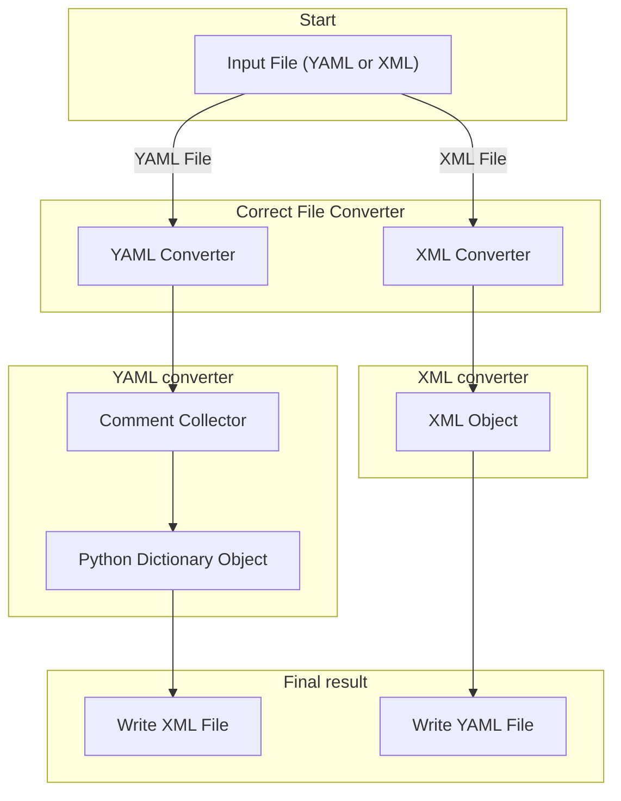

[](https://github.com/astral-sh/ruff)  [](https://pypi.org/project/nyaml/) [](https://github.com/FAIRmat-NFDI/nyaml/actions/workflows/pytest.yaml)[](https://doi.org/10.5281/zenodo.13860810)

# Table of Contents

1. [Introduction](#introduction)
2. [nyaml Workflow](#nyaml-workflow)
3. [How to Use nyaml Tool](#how-to-use-nyaml-tool)
4. [Conversion from YAML to XML](#conversion-from-yaml-to-xml)
5. [Design of NeXus Ontology and Terms in YAML](#design-of-nexus-dataformat-and-terms-in-yaml)
   - [Root section for base classes and application definitions](#root-section-for-base-classes-and-application-definitions)
   - [NeXus Group](#nexus-group)
   - [NeXus Field and NeXus Attrubute](#nexus-field-and-nexus-attrubute)
   - [NeXus Link](#nexus-link)
   - [NeXus Choice](#nexus-choice)
6. [Special Keywords in YAML](#special-keywords-in-yaml)
   - [Keyword `exists`](#keyword-exists)
   - [Keyword `unit`](#keyword-unit)
   - [Keyword `dimensions`](#keyword-dimensions)
   - [Keyword `enumeration`](#keyword-enumeration)
   - [Keyword `xref`](#keyword-xref)
7. [How to Install nyaml](#how-to-use-nyaml-tool)
8. [Conclusion](#conclusion)
9. [References](#references)

## Introduction

The NeXus data format, described by the NeXus Definition Language (NXDL), represents a concerted effort aimed at facilitating data exchange within scientific communities, particularly among those engaged in neutron, X-ray, and muon research [J. Appl. Cryst. (2015). 48, 301-305](https://doi.org/10.1107/S1600576714027575). The data format is also being used by the material science community under the project [NeXus-FAIRmat](https://fairmat-nfdi.github.io/nexus_definitions/) supporting FAIR (Findable, Accessible, Interoperable and Reuseable) data principle. It serves as a standardized framework for both data exchange and storage. At its core, the NeXus Definition Language (NXDL) functions as the cornerstone through which scientists delineate the nomenclature and organizational structure of information within NeXus data files, tailored to specific scientific techniques.

NXDL is used to define general data storage objects (base classes) and the base classes are the building blocks for defining measurement-specific or even instrument-specific or software-specific data storage objects (application definitions). In this process, members and definitions of individual base classes can be used as is or customized. In essence, the process of schema development, whether for a base class or an application definition, entails crafting an NXDL schema definition file with the extension 'nxdl.xml', utilizing the Extensible Markup Language, [XML](https://www.w3.org/TR/REC-xml/REC-xml-20081126.xml) .

To expedite the schema development process, we have introduced the use of Yet Another Markup Language ([YAML](https://yaml.org/)), which provides a syntax or style specifically tailored for defining scientific domain-driven schemas with NXDL. One significant advantage of YAML over XML is its indentation-driven approach, which eliminates the need for starting and ending tags for each entity within the schema. The `YAML` format results in a reduction of NXDL keyword repetition and allows for a intuitive grasp with object oriented programing domain, such as class inheritance. These benefits are attained without compromising the integrity of the original NeXus schema, which is traditionally expressed in XML format.

The `YAML` format, while not yet an official version of NeXus application definitions or base classes, necessitates a method for transcoding it into `XML`. The [nyaml](https://github.com/FAIRmat-NFDI/nyaml/tree/main) Python package serves as a converter tool designed specifically for this purpose. It enables the conversion of NXDL from `YAML` format to `XML`, thereby enhancing the capability of NeXus schema developers to incorporate domain-specific scientific knowledge into the schema. Furthermore, the tool offers the flexibility to extend existing NeXus schemas in XML by facilitating conversion back and forth between the two formats. It is important to note that here we do not introduce NeXus data objects, terms, or types, which are fundamental for writing base class schemas or application definition schemas. For individuals new to NeXus, we refer to the official NeXus site at NeXus [official site](https://www.nexusformat.org/).

## nyaml Workflow

Like every scientific software, the `nyaml` tool also follows a specific workflow.



For a given input file, the `nyaml` converter checks for the correct file type and call appropriate converter. For an XML file, the XML converter parses the `XML` file, by means of [lxml](https://lxml.de/) python library, into an `XML` tree object. Adhering to the NXDL rules, the converter writes the application definition or the base class object to a `yaml` file that matches the `nyaml` syntax. If the input file is a `yaml` file, the `yaml` converter collects the comments in a `Comments` object and parses the `yaml` file into a python `dictionary` object. Later, the application definition or base classes will be converted into an `XML` file by combining the `Comments` and the python `dictionary` object.

## How to Install nyaml
The tool is published to `PyPI` and available for pip install
```bash
$ pip install nyaml
```
To contribute to the tool or to install it in development mode
```bash
$ git clone https://github.com/FAIRmat-NFDI/nyaml.git
$ cd nyaml
$ pip install -e ".[dev]"
```

There is also a [pre-commit hook](https://pre-commit.com/#intro) available which formats the code and checks the linting before actually commiting. It can be installed with
```bash
$ pre-commit install
```

## How to Use the nyaml Tool
The `nyaml` works as a command line tool to convert NeXus application definition or base class from `yaml` file format into the `nxdl.xml` file format and vice-versa. The converter can be called by the command

```bash
$ nyaml2nxdl [OPTIONS] [INPUT_FILE]
```
with the available options:
```output
  --output-file TEXT   Specify the output file path for the converted file.
  --check-consistency  Check whether YAML and NXDL can be recursively
                       converted, ensuring version consistency.
  --do-not-store-nxdl  Prevent the input NXDL file from being stored as a
                       comment at the end of the output YAML file.
  --verbose            Display keywords and value types in standard output to
                       assist in identifying issues in YAML files.
  --help               Show this message and exit.
```
The `--output-file` option can be used to define the output file name (including the fle extension), otherwise the converter will define the output file name from the input file, e.g., for the input file `NXapplication.nxdl.xml (NXapplication.yaml)`, the resultant file will be `NXapplication_parser.yaml (NXapplication.nxdl.xml)`. With the option `--check-consistency` the converter produces the same type of file as the input, e.g. for input `NXapplication.nxdl.xml` the output file is `NXapplication_consistency.nxd.xml`. The intention for this option is to verify proper file and version conversion of the file. When converting the `nxdl.xml` file into `yaml` it also stores the `nxdl.xml` file at the end of `yaml` file with a hash. The option `--do-not-store-nxdl` prevents the `yaml` file from storing the original `nxdl.xml` text. The `verbose` option is to identify any issues arising from unexpected conversion or syntax errors that occur while converting the file from one to another.
The `--output-file` option if user wants to define output file name (including extension) otherwise converter will define the output file name e.g. from input file `NXapplication.nxdl.xml (NXapplication.yaml)` the resultant file will be `NXapplication_parser.yaml (NXapplication.nxdl.xml)`. With the option `--check-consistency` the converter produces the same type of file as the input, e.g. for input `NXapplication.nxdl.xml` the output file is `NXapplication_consistency.nxd.xml`. The intention for this option is to verify proper file and version conversion of the file. When converting the `nxdl.xml` file into `yaml` it also stores the `nxdl.xml` file at the end of `yaml` file with a hash. The option `--do-not-store-nxdl` prevents the `yaml` file from storing `nxdl.xml` text. The `verbose` option is to identify the issue, if there are some unexpected conversion, while converting the file from one to another.

## Conversion from YAML to XML
Presented below is a concise and trimmed example of the `NXmpes` application definition (not a full application definition) in `YAML` format, alongside its corresponding translation into `XML` format, as illustrated below. Subsequently, the fundamental rules governing this conversion process are elucidated. For a comprehensive understanding of the basic structure of NXDL, readers are encouraged to explore the [NeXus Manual](https://manual.nexusformat.org/user_manual.html). Throughout the following discussions, various components of the NXmpes application definition will be discussed in the light of `nyaml` converter.

**NXmpes application definition in YAML format**
```yaml
category: application
type: group
doc: |
  This is the most general application definition for multidimensional photoelectron spectroscopy.

  .. _ISO 18115-1:2023: https://www.iso.org/standard/74811.html
  .. _IUPAC Recommendations 2020: https://doi.org/10.1515/pac-2019-0404
symbols:
  doc: |
    The symbols used in the schema to specify e.g. dimensions of arrays
  n_transmission_function: |
    Number of data points in the transmission function.
NXmpes(NXobject):
  (NXentry):
    exsits: required
    definition:
      \@version:
      enumeration: [NXmpes]
    title:
    start_time(NX_DATE_TIME):
      doc: |
        Datetime of the start of the measurement.
    end_time(NX_DATE_TIME):
      exists: recommended
      doc: |
        Datetime of the end of the measurement.
    (NXinstrument):
      doc:
      - |
        Description of the MPES spectrometer and its individual parts.
      - |
        xref:
          spec: ISO 18115-1:2023
          term: 12.58
          url: https://www.iso.org/obp/ui/en/#iso:std:iso:18115:-1:ed-3:v1:en:term:12.58
      source_TYPE(NXsource):
        exists: recommended
        doc: |
          A source used to generate a beam.
      (NXmanipulator):
        exists: optional
        doc: |
          Manipulator for positioning of the sample.
        value_log(NXlog):
          exists: optional
          value(NX_NUMBER):
            unit: NX_PRESSURE
            doc: |
              In the case of an experiment in which the gas pressure changes and is recorded,
              this is an array of length m of gas pressures.
    (NXprocess):
      exists: recommended
      doc: |
        Document an event of data processing, reconstruction, or analysis for this data.
      transmission_correction(NXcalibration):
        exists: optional
        doc: |
          This calibration procedure is used to account for the different tranmsission efficiencies.
        transmission_function(NXdata):
          exists: recommended
          doc: |
            Transmission function of the electron analyser.
          \@axes:
            enumeration: [kinetic_energy]
          kinetic_energy(NX_FLOAT):
            unit: NX_ENERGY
            doc: |
              Kinetic energy values
            dimensions:
              rank: 1
              dim: [[1, n_transmission_function]]
```

**NXmpes application definition in nxdl.xml format**
```xml
  <?xml version='1.0' encoding='UTF-8'?>
  <?xml-stylesheet type="text/xsl" href="nxdlformat.xsl"?>
  <definition xmlns="http://definition.nexusformat.org/nxdl/3.1" xmlns:xsi="http://www.w3.org/2001/XMLSchema-instance" category="application" type="group" name="NXmpes" extends="NXobject" xsi:schemaLocation="http://definition.nexusformat.org/nxdl/3.1 ../nxdl.xsd">
      <symbols>
          <doc>
              The symbols used in the schema to specify e.g. dimensions of arrays
          </doc>
          <symbol name="n_transmission_function">
              <doc>
                  Number of data points in the transmission function.
              </doc>
          </symbol>
      </symbols>
      <doc>
          This is the most general application definition for multidimensional
          photoelectron spectroscopy.

          .. _ISO 18115-1:2023: https://www.iso.org/standard/74811.html
          .. _IUPAC Recommendations 2020: https://doi.org/10.1515/pac-2019-0404
      </doc>
      <group type="NXentry">
          <field name="definition">
              <attribute name="version"/>
              <enumeration>
                  <item value="NXmpes"/>
              </enumeration>
          </field>
          <field name="title"/>
          <field name="start_time" type="NX_DATE_TIME">
              <doc>
                  Datetime of the start of the measurement.
              </doc>
          </field>
          <field name="end_time" type="NX_DATE_TIME" recommended="true">
              <doc>
                  Datetime of the end of the measurement.
              </doc>
          </field>
          <group type="NXinstrument">
              <doc>
                  Description of the MPES spectrometer and its individual parts.

                  This concept is related to term `12.58`_ of the ISO 18115-1:2023 standard.

                  .. _12.58: https://www.iso.org/obp/ui/en/#iso:std:iso:18115:-1:ed-3:v1:en:term:12.58
              </doc>
              <group name="source_TYPE" type="NXsource" recommended="true">
                  <doc>
                      A source used to generate a beam.
                  </doc>
              </group>
              <group type="NXmanipulator" optional="true">
                  <doc>
                      Manipulator for positioning of the sample.
                  </doc>
                  <group name="value_log" type="NXlog" optional="true">
                      <field name="value" type="NX_NUMBER" units="NX_PRESSURE">
                          <doc>
                              In the case of an experiment in which the gas pressure changes and is recorded,
                              this is an array of length m of gas pressures.
                          </doc>
                      </field>
                  </group>
              </group>
          </group>
          <group type="NXprocess" recommended="true">
              <doc>
                  Document an event of data processing, reconstruction, or analysis for this data.
              </doc>
              <group name="transmission_correction" type="NXcalibration" optional="true">
                  <doc>
                      This calibration procedure is used to account for the different tranmsission
                      efficiencies.
                  </doc>
                  <group name="transmission_function" type="NXdata" recommended="true">
                      <doc>
                          Transmission function of the electron analyser.
                      </doc>
                      <attribute name="axes">
                          <enumeration>
                              <item value="kinetic_energy"/>
                          </enumeration>
                      </attribute>
                      <field name="kinetic_energy" type="NX_FLOAT" units="NX_ENERGY">
                          <doc>
                              Kinetic energy values
                          </doc>
                          <dimensions rank="1">
                              <dim index="1" value="n_transmission_function"/>
                          </dimensions>
                      </field>
                  </group>
              </group>
          </group>
      </group>
  </definition>
```

## Design of NeXus Ontology and Terms in YAML

Within the YAML format, the root section denotes the top-level description of the application definition or base class schema, comprising the `category`, `type`, `doc`, `symbols` block, and the name of the schema (e.g. `NXmpes(NXobject)`). Correspondingly, the root section refers to the XML element `definition`, encompassing the first `doc` child of the `definition` and `symbols`. The definition element encapsulates essential XML attributes such as the schema's `name` (and xml attribute), the object it `extends` (an xml attribute), and the schema `type` (an xml attribute), with additional XML attributes (e.i. `xmlns:xsi`) handled by the nyaml converter. The accurate designation of category as either `base` or `application` distinguishes between an `application definition` and a `base class`. The schema name (e.i. `NXmpes(NXobject)`) with paranthesis indicates the extension of the current application definition, noting that base classes must `extends` NXobject, whereas application definitions may `extends` either `NXobject` or another `application definition` (excluding base classes). Schemas may incorporate one or multiple symbols, each imbued with specialized physical meanings beyond their literal interpretation, which are utilised over the application definition.
Within the YAML format, the root section denotes the top-level description of the application definition or base class schema, comprising the `category`, `type`, `doc`, `symbols` block, and the name of the schema (e.g. `NXmpes(NXobject)`). Correspondingly, the root section refers to the XML element `definition`, encompassing the first `doc` child of the `definition` and `symbols`. The definition element encapsulates essential xml attributes such as the schema's `name` (and xml attribute), the object it `extends` (an xml attribute), and the schema `type` (an xml attribute), with additional XML attributes (e.i. `xmlns:xsi`) handled by the nyaml converter. The accurate designation of category as either `base` or `application` distinguishes between an `application definition` and a `base class`. The schema name (e.i. `NXmpes(NXobject)`) with paranthesis indicates the extension of the current application definition, noting that base classes must `extends` NXobject, whereas application definitions may `extends` either `NXobject` or another `application definition` (excluding base classes). Schemas may incorporate one or multiple symbols, each imbued with specialized physical meanings beyond their literal interpretation, which are utilised over the application definition.

**A typical root section for the application definition `NXmpes` outlined**

```yaml
category: application
type: group
doc: |
  This is the most general application definition for multidimensional photoelectron spectroscopy.

  .. _ISO 18115-1:2023: https://www.iso.org/standard/74811.html
  .. _IUPAC Recommendations 2020: https://doi.org/10.1515/pac-2019-0404
symbols:
  doc: |
    The symbols used in the schema to specify e.g. dimensions of arrays
  n_transmission_function: |
    Number of data points in the transmission function.
NXmpes(NXobject):
```

### NeXus Group
[NeXus groups](https://manual.nexusformat.org/design.html#design-groups), as instances of NeXus base classes, embody the compositional structure of application definitions. These groups can be initialized dynamically or statically, each approach offering distinct advantages.

Dynamic initialization allows for the instantiation of groups while implementing the NeXus definition to store data (in HDF5 file format called NeXus file). This method provides flexibility for multiple instances at the same level within the NeXus file. For instance, the group `(NXmanipulator)` can initialize multiple groups such as `manipulator1` and `manipulator2` of the base class `NXmanipulator` during data writing.


Descriptive information about NeXus groups is encapsulated within the `doc` child of the respective group. It is important to note that the group annotation of `source_TYPE(NXsource)` or `(NXsource)source_TYPE` signifies the encapsulation of the group's `name` as `source_TYPE` and its type as `NXsource` base class. Notably, the order between `name` and `type` within the XML element must be inverted such two different syntax.

Furthermore, the uppercase part of the group's name can be dynamically overwritten, allowing for the instantiation of multiple instances. For example, `source_electric` and `source_magnetic` can coexist from `NXsource`. It is essential to adhere to the uppercase dynamic rules for NeXus groups, fields, and attributes.


**NeXus Groups in YAML format**
```yaml
# NeXus groups in YAML format
source_TYPE(NXsource):
  exists: recommended
  doc: |
    A source used to generate a beam.
(NXmanipulator):
  exists: optional
  doc: |
    Manipulator for positioning of the sample.
  value_log(NXlog):
    exists: optional
```

### NeXus Field and NeXus Attrubute
A NeXus group may contain NeXus fields, NeXus attributes, and NeXus groups. A field, that does not have preceding `NX`, and a attribute, preceded by `\@`, must have a [NeXus type](https://manual.nexusformat.org/nxdl-types.html#index-0) (e.g.`NX_FLOAT`, `NX_CHAR`). In the YAML notation, each NeXus field or NeXus attribute has a implicit type `NX_CHAR`; otherwise its type must be denoted inside the parenthesis (e.g. `end_time(NX_DATE_TIME)`). Other XML attributes of the NeXus `field` and NeXus `attribute` comes as children of the field and attribute (the special keywords will be discussed on next section). The introductory text of the NeXus fields or attributes goes under `doc` child.

A NeXus group may encompass multiple `field`, `attribute`, and subgroup, each serving distinct purposes within the data structure. The [`field`](https://manual.nexusformat.org/design.html#design-fields), denoted without the prefix NX, and the [`attribute`](https://manual.nexusformat.org/design.html#design-attributes), indicated by `\@`, must be associated with a NeXus type (e.g., `NX_FLOAT`, `NX_CHAR`). In YAML format, each field or attribute (NeXus attribute) implicitly assumes the type `NX_CHAR`, unless explicitly specified within parentheses (e.g., `end_time(NX_DATE_TIME)`).

Additionally, `XML` attributes specific to NeXus field and attribute are represented as children of the corresponding `field` or `attribute` elements (further details on special keywords will be discussed in the following section). Descriptive information pertaining to NeXus `field`s or `attribute`s is encapsulated within the `doc` child element.

**NeXus field and attribute in YAML format**
```yaml
(NXentry):
  exsits: required
  definition:  # Field type: NX_CHAR
    \@version:  # Attribute type: NX_CHAR
    enumeration: [NXmpes]
  title:
  start_time(NX_DATE_TIME):  # Field type: NX_DATE_TIME
    doc: Datetime of the start of the measurement.
  end_time(NX_DATE_TIME):  # Field type: NX_DATE_TIME
    exists: recommended
    doc: Datetime of the end of the measurement.
```

### NeXus Link
The NeXus `link` concept reduces duplication of the data since several concepts of the same kind (e.g., NeXus field or NeXus attribute) can refer to a single copy of a data element . In YAML format, NeXus `link` is defined denoting the link in side parenthesis. At the same time, the concept containing the data must be mentioned under the `target` child.


**NeXus link in YAML format**
```yaml
reference_measurement(link):
  target: /NXentry
  doc: A link to a full data collection.
```

In the provided YAML example, `reference_measurement` is defined as a link refering the `NXentry` group with its target specified as `/NXentry`. This structure ensures that the concept referencing the data is effectively linked to the designated target, thereby reducing redundancy and maintaining data integrity within the NeXus framework.

### NeXus Choice
NeXus `choice` concept is designed to choose a concept from a number of concepts of the same kind (e.g., a NeXus field). The `choice` options allows for defining a scientific concept in several modes for different situations (e.g., for different instrument configurations or measurement modes).

**NeXus choice in YAML format**
```yaml
pixel_shape(choice):
  (NXoff_geometry):
    doc: Shape description of each pixel. Use only if all pixels in the detector
      are of uniform shape.
  (NXcylindrical_geometry):
    doc: Shape description of each pixel. Use only if all pixels in the detector
      are of uniform shape and require being described by cylinders.
```

In this `choice` example, `pixes_shape` could be any of the groups `(NXoff_geometry)` and `(NXcylindrical_geometry)`, depending on the geometry of the pixelx.

## Special Keywords in YAML
To explain the context of NeXus, certain keywords hold significance beyond their literal interpretations. These special keywords are utilized to elucidate and denote various NeXus terms like attributes, fields, links, and groups, thereby enhancing the clarity and specificity of the data representation.

### Keyword `exists`
The `exists` keyword plays a pivotal role in delineating the optionality of NeXus concepts `attribute`, `field`, `choice` `link`, and `group`, during the implementation of NeXus definitions in NeXus files. It provides crucial insights into the expected presence or absence of these concepts within the NeXus data structure. By default, all the concepts of a base class are optional, while in an application definition, all concepts are required.

Presently, the accepted values for the `exists` keyword encompass:

`optional`: Denotes that the NeXus concept is not mandatory and may be absent.
`recommended`: Suggests that the NeXus concept is advisable, but not mandatory.
`required`: Indicates that the NeXus concept must be present within the structure. Any validation of a NeXus file will fail if required concepts (for a given application definition) are not available.
`[min, <number>, max, <number> or infty]`: Represents an array type value that signifies the multiplicity of the NeXus concepts. For instance, a concept having the keyword `exists: [min, 3, max, infty]` implies that this concept must come with a minimum of three instances and may extend to any number of instances.

**`exists` in YAML**

```yaml
transmission_correction(NXcalibration):
  exists: optional
  doc: |
    This calibration procedure is used to account for the different tranmsission efficiencies.
```
In the above example the greoup `transmission_correction` is a optional group.

### Keyword `unit`
A statement introducing NeXus-compliant NXDL `units` attribute to the `field`, e.g. `NX_VOLTAGE` to assign a predefined physical unit.

**`unit` in YAML**

```yaml
detector_voltage(NX_FLOAT):
  unit: NX_VOLTAGE
  doc: |
    Voltage applied to detector.
```

### Keyword `dimensions`
The `dimensions` term  describes the multidimensional nature of the data, specifying its rank, dimensional indices, and corresponding length of the rank. For example, the attribute `rank` defines the dimension of the data set. To elucidate each dimension, we use two other keywords: `dim` and `dim_parameters`. The `dim` keyword comprises an array of arrays, the nested array encapsulates values for `index` and `value` (NeXus keywords) pairs. Each array within the `dim` array corresponds to a specific dimension of the multidimensional data. For example, for 2D particle motion, the `dim` array may be represented as `[[0, nx], [1, ny]]`, indicating the axes index and its length. The keyword `dim_parameters` contains further information of each dimension such as `doc`, `ref`, etc. It is important to note that each term or keyword within `dim_parameters` must have the same length as the value of the rank keyword.

**`dimensions` in YAML**
```yaml
# 2D particle motion
dimensions:
   rank: 2
   dim: [[0, nx], [1, ny]]
   dim_parameters:
      doc: ["Position of particle on x-axis.","Position of particle on y-axis."]
```
The `dimensions` can also be written in shorter form
**Dimensions in YAML (shorter form)**
```yaml
# 2D particle motion
dimensions:
   rank: 2
   dim: (nx, ny)
```

### Keyword `enumeration`

Enumerations are used in NeXus to define the allowed values for fields or attributes.

**Enumeration in YAML**

There are multiple ways of implementing enumerations the `YAML` representation.

The simplest possible solution is to use a Python-like list of strings:

```yaml
definition:
  \@version:
  enumeration: [NXmpes]
```

Here, the valid value for NeXus field `definition` is `NXmpes`.

Note that the same can be achieved by writing

```yaml
definition:
  \@version:
  enumeration: 
    items: [NXmpes]
```

Another possibility is to add documentation for each enumeration item:

```yaml
mode:
    doc: |
      source operating mode
    enumeration:
      Single Bunch:
        doc: |
          for storage rings
      Multi Bunch:
        doc: |
          for storage rings
```

Here, the valid value for NeXus field `mode` are `Single Bunch` and `Multi Bunch`.

**Enumeration for lists in YAML**

It is possible to implement a list of lists for fields/attributes that expect a list of values.
The convention for doing so is

```yaml
  \@vector(NX_NUMBER):
    doc: |
      This is an enumeration for a vector, where the individual items are lists themselves.
    enumeration: [[1, 0, 0], [0, 1, 0], [0, 0, -1]]
```

Note that each element in the individual enumeration items is an integer, in line with the defined NeXus data types `NX_NUMBER` of `\@vector`.

**Open enumeration in YAML**

NeXus also allows open enumerations. These are for cases where the enumeration list is not
exhaustive, but also other items than those are recommended are allowed. In the `YAML` representation, this can be achieved by using the boolean `open_enum` keyword:

```yaml
mode:
    doc: |
      source operating mode
    enumeration:
      open_enum: True
      items: [Single Bunch, Multi Bunch]
```

Or in the case that each enumeration item has a docstring:

```yaml
mode:
    doc: |
      source operating mode
    enumeration:
      open_enum: True
      Single Bunch:
        doc: |
          for storage rings
      Multi Bunch:
        doc: |
          for storage rings
```


### Keyword `xref`
The `xref` keyword (which can only inside the keyword `doc`) is used to refer any other ontology or any other standard such `ISO`. The `xref` in the example `doc` will reflect the information inside the XML `doc`. Note that the `xref` keyword is only available in the `YAML` representation and will be transformed into its textual representation inside the `doc` text in `XML`.

**`xref` in YAML**
```yaml
(NXinstrument):
  doc:
  - |
    Description of the MPES spectrometer and its individual parts.
  - |
    xref:
      spec: ISO 18115-1:2023
      term: 12.58
      url: https://www.iso.org/obp/ui/en/#iso:std:iso:18115:-1:ed-3:v1:en:term:12.58
```

## Conclusion
Defining a NeXus application definition or base class in YAML format is not an official structure of NeXus. The single source of truth for the NeXus definitions remains the XML reprensentation. However, the NYAML format serves to reduce the effort of the  developer to construct an application definition or base class. `nyaml` is the tool to convert the application definitions or base classes from the `YAML` reprensentation `nxdl.xml` (`XML` type) format with any knowledge of `XML` style or syntax. This is a open source software funded by the [German National Data Infrastructure (NFDI)](https://www.nfdi.de/) within the [FAIRmat](https://www.fairmat-nfdi.eu/fairmat/) project. Thus, the tool is open to contribution and suggestion for improvements, e.g., through creating issues on the public GitHub repository. `nyaml` is also [published in PyPi](https://pypi.org/project/nyaml/) and can be installed with `pip` python package manageer.


## References
[@Könnecke]: J. Appl. Cryst. (2015). 48, 301-305
             (https://doi.org/10.1107/S1600576714027575)
NeXus-FAIRmat: https://fairmat-nfdi.github.io/nexus_definitions/
