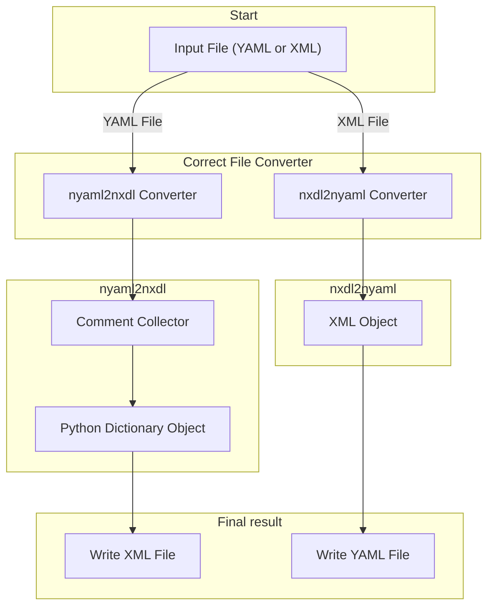

## nyaml Workflow
For a given input file, the `nyaml` converter checks for the correct file type and call appropriate converter. For an XML file, the `nxdl2yaml` converter parses the `XML` file, by means of [lxml](https://lxml.de/) python library, into an `XML` tree object. Adhering to the NXDL rules, the converter writes the application definition or the base class object to a `yaml` file that matches the `nyaml` syntax. If the input file is a `yaml` file, the `yaml2nxdl` converter collects the comments in a `Comments` object and parses the `yaml` file into a python `dictionary` object. Later, the application definition or base classes will be converted into an `XML` file by combining the `Comments` and the python `dictionary` object.

Like every scientific software, the `nyaml` tool also follows a specific workflow.



## Conversion from YAML to XML and vice versa
Presented below is a concise and trimmed example of the `NXmpes` application definition (for discussion purpose) in `YAML` format, alongside its corresponding encoding into `XML` format, as illustrated below. Subsequently, the fundamental rules governing this conversion process are elucidated. For a comprehensive understanding of the basic structure of NXDL, readers are encouraged to explore the [NeXus Manual](https://manual.nexusformat.org/user_manual.html). NOTE: For indetailed explanation with examples please follow the [Tutorials for writing NeXus definition in YAML](tutorials.md).

**NXmpes application definition in YAML format**
```yaml
category: application
type: group
doc: |
  This is the most general application definition for multidimensional photoelectron spectroscopy.

  .. _ISO 18115-1:2023: https://www.iso.org/standard/74811.html
  .. _IUPAC Recommendations 2020: https://doi.org/10.1515/pac-2019-0404
symbols:
  doc: |
    The symbols used in the schema to specify e.g. dimensions of arrays
  n_transmission_function: |
    Number of data points in the transmission function.
NXmpes(NXobject):
  (NXentry):
    exsits: required
    definition:
      \@version:
      enumeration: [NXmpes]
    title:
    start_time(NX_DATE_TIME):
      doc: |
        Datetime of the start of the measurement.
    end_time(NX_DATE_TIME):
      exists: recommended
      doc: |
        Datetime of the end of the measurement.
    (NXinstrument):
      doc:
      - |
        Description of the MPES spectrometer and its individual parts.
      - |
        xref:
          spec: ISO 18115-1:2023
          term: 12.58
          url: https://www.iso.org/obp/ui/en/#iso:std:iso:18115:-1:ed-3:v1:en:term:12.58
      source_TYPE(NXsource):
        exists: recommended
        doc: |
          A source used to generate a beam.
      (NXmanipulator):
        exists: optional
        doc: |
          Manipulator for positioning of the sample.
        value_log(NXlog):
          exists: optional
          value(NX_NUMBER):
            unit: NX_PRESSURE
            doc: |
              In the case of an experiment in which the gas pressure changes and is recorded,
              this is an array of length m of gas pressures.
    (NXprocess):
      exists: recommended
      doc: |
        Document an event of data processing, reconstruction, or analysis for this data.
      transmission_correction(NXcalibration):
        exists: optional
        doc: |
          This calibration procedure is used to account for the different tranmsission efficiencies.
        transmission_function(NXdata):
          exists: recommended
          doc: |
            Transmission function of the electron analyser.
          \@axes:
            enumeration: [kinetic_energy]
          kinetic_energy(NX_FLOAT):
            unit: NX_ENERGY
            doc: |
              Kinetic energy values
            dimensions:
              rank: 1
              dim: [[1, n_transmission_function]]
```

**NXmpes application definition in nxdl.xml format**
```xml
  <?xml version='1.0' encoding='UTF-8'?>
  <?xml-stylesheet type="text/xsl" href="nxdlformat.xsl"?>
  <definition xmlns="http://definition.nexusformat.org/nxdl/3.1" xmlns:xsi="http://www.w3.org/2001/XMLSchema-instance" category="application" type="group" name="NXmpes" extends="NXobject" xsi:schemaLocation="http://definition.nexusformat.org/nxdl/3.1 ../nxdl.xsd">
      <symbols>
          <doc>
              The symbols used in the schema to specify e.g. dimensions of arrays
          </doc>
          <symbol name="n_transmission_function">
              <doc>
                  Number of data points in the transmission function.
              </doc>
          </symbol>
      </symbols>
      <doc>
          This is the most general application definition for multidimensional
          photoelectron spectroscopy.

          .. _ISO 18115-1:2023: https://www.iso.org/standard/74811.html
          .. _IUPAC Recommendations 2020: https://doi.org/10.1515/pac-2019-0404
      </doc>
      <group type="NXentry">
          <field name="definition">
              <attribute name="version"/>
              <enumeration>
                  <item value="NXmpes"/>
              </enumeration>
          </field>
          <field name="title"/>
          <field name="start_time" type="NX_DATE_TIME">
              <doc>
                  Datetime of the start of the measurement.
              </doc>
          </field>
          <field name="end_time" type="NX_DATE_TIME" recommended="true">
              <doc>
                  Datetime of the end of the measurement.
              </doc>
          </field>
          <group type="NXinstrument">
              <doc>
                  Description of the MPES spectrometer and its individual parts.

                  This concept is related to term `12.58`_ of the ISO 18115-1:2023 standard.

                  .. _12.58: https://www.iso.org/obp/ui/en/#iso:std:iso:18115:-1:ed-3:v1:en:term:12.58
              </doc>
              <group name="source_TYPE" type="NXsource" recommended="true">
                  <doc>
                      A source used to generate a beam.
                  </doc>
              </group>
              <group type="NXmanipulator" optional="true">
                  <doc>
                      Manipulator for positioning of the sample.
                  </doc>
                  <group name="value_log" type="NXlog" optional="true">
                      <field name="value" type="NX_NUMBER" units="NX_PRESSURE">
                          <doc>
                              In the case of an experiment in which the gas pressure changes and is recorded,
                              this is an array of length m of gas pressures.
                          </doc>
                      </field>
                  </group>
              </group>
          </group>
          <group type="NXprocess" recommended="true">
              <doc>
                  Document an event of data processing, reconstruction, or analysis for this data.
              </doc>
              <group name="transmission_correction" type="NXcalibration" optional="true">
                  <doc>
                      This calibration procedure is used to account for the different tranmsission
                      efficiencies.
                  </doc>
                  <group name="transmission_function" type="NXdata" recommended="true">
                      <doc>
                          Transmission function of the electron analyser.
                      </doc>
                      <attribute name="axes">
                          <enumeration>
                              <item value="kinetic_energy"/>
                          </enumeration>
                      </attribute>
                      <field name="kinetic_energy" type="NX_FLOAT" units="NX_ENERGY">
                          <doc>
                              Kinetic energy values
                          </doc>
                          <dimensions rank="1">
                              <dim index="1" value="n_transmission_function"/>
                          </dimensions>
                      </field>
                  </group>
              </group>
          </group>
      </group>
  </definition>
```
