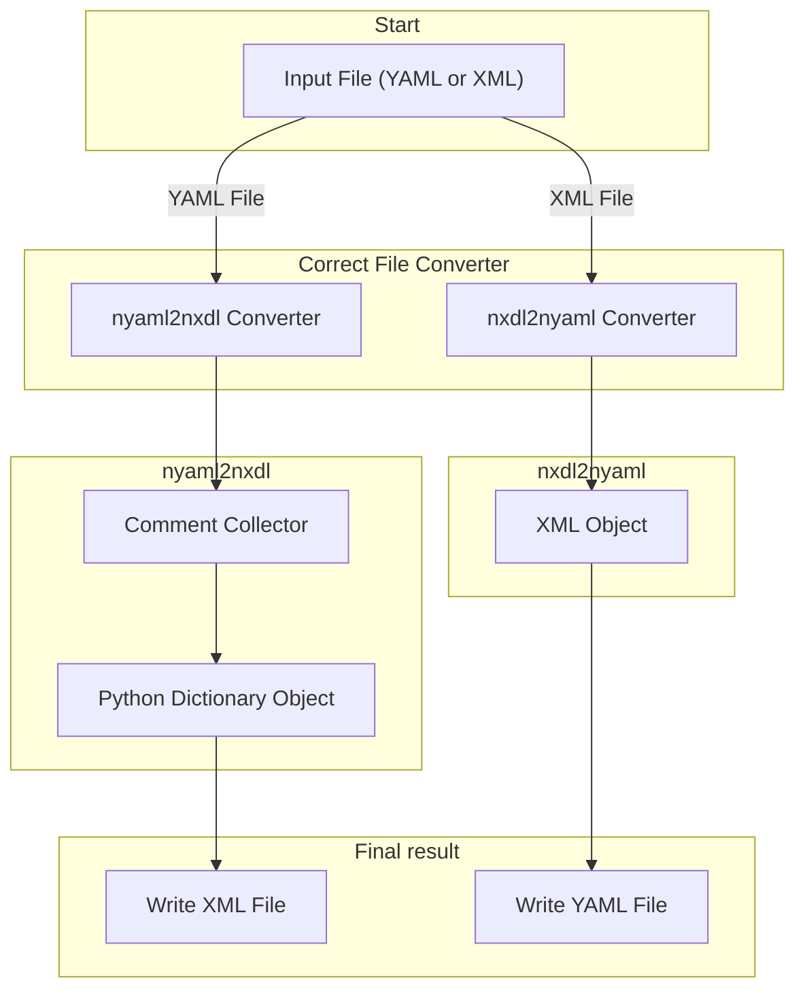

```mermaid
graph TD;
  subgraph Start
    id1["Input File (YAML or XML)"]
  end
  subgraph Correct File Converter
    id2["nyaml2nxdl Converter"]
    id3["nxdl2nyaml Converter"]
  end
  subgraph nyaml2nxdl
    id4["Comment Collector"]
    id5["Python Dictionary Object"]
  end
  subgraph nxdl2nyaml
    id6["XML Object"]
  end
  subgraph Final result
  id7["Write XML File"]
  id8["Write YAML File"]
  end

  id1--> |YAML File|id2
  id1--> |XML File|id3
  id2-->id4
  id4-->id5
  id3-->id6
  id5-->id7
  id6-->id8
```
