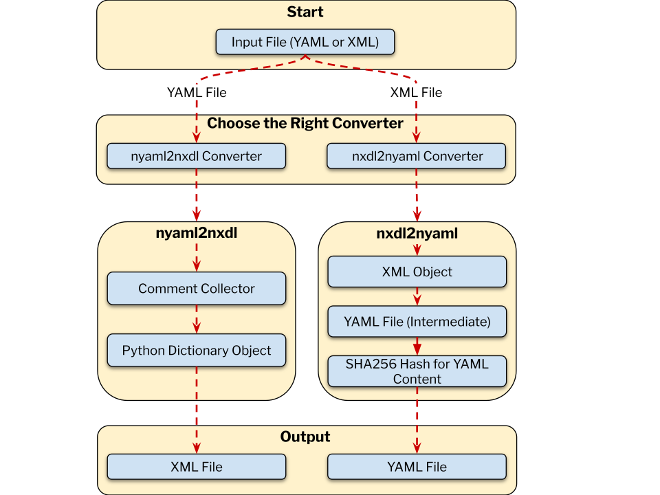

# Summary

The NeXus scientific data format standard [@Könnecke:2015; @Könnecke2006; @Klosowski1997], which was originally introduced for neutron, X-ray, and muon science, has in recent years seen a significant enhancement across diverse scientific domains such as materials science. NeXus definitions—comprising application definitions and base classes—describe the hierarchical structure and semantics of valid NeXus files. They are written in XML [@xml10] using the NeXus Definition Language (NXDL), which is itself defined in XSD (XML Schema Definition) [@w3c:xmlschema1].

`nyaml` is a Python-based tool with both a command-line interface and an application programming interface (API) that facilitates the conversion between NXDL XML and a simplified YAML [@YAML11] representation. YAML's indentation-based syntax enhances human readability and simplifies manual editing. By providing a reliable, lossless round-trip conversion between XML and YAML, `nyaml` enables developers to edit NeXus definitions efficiently without sacrificing structural or semantic fidelity.

# Statement of need

As the NeXus standard and its community of definition developers continue to grow, it is increasingly important to ensure that the development process remains both user-friendly and resilient to errors. The existing representation of NeXus definitions in XML offers structural rigor through the NeXus Definition Language (NXDL) and a well-defined hierarchy for metadata and data types. However, it is verbose and can be difficult to edit by hand. Writing and maintaining NXDL files often involves dealing with deeply nested elements and strict syntax, which can be error-prone and time-consuming, especially for users who are not familiar with XML development. `nyaml` addresses these challenges by enabling the development of NeXus definitions in a simpler, YAML-based format while preserving the full structure, semantics, and developer comments of the original XML. As a successful stress test, the tool has been used for developing extensions of the NeXus definitions for different microscopy and spectroscopy methods to integrate the definitions into the research data management system NOMAD [@NOMAD2023].

# State of the field
Currently, no tool exists in the NeXus community or the broader open-source community for converting NeXus definitions between XML and YAML formats.

# Software design

`nyaml` is a Python package developed for converting NeXus definitions from YAML format (files with a `.yaml` extension) into the XML format (files with a `.nxdl.xml` extension) and vice versa. The package is published on PyPI and therefore can be installed using Python package managers (e.g., `pip` [@pip2025]). The `nyaml` package introduces a set of keywords and syntactic rules (see [documentation](https://fairmat-nfdi.github.io/nyaml)) that are specific to NXDL (NeXus Definition Language) in YAML. The keywords and syntactic rules imply a relationship between YAML and XML (XML tags and attributes) structures, enabling seamless conversion for new and existing definitions. Existing definitions can be modified using the following workflow: **XML $\rightarrow$ YAML $\rightarrow$ modification of YAML $\rightarrow$ XML**. New definitions can be designed in YAML and converted to XML directly.

The tool can be used as a command-line utility or imported as a Python module for programmatic use. The converter command is invoked using `nyaml2nxdl`, which determines the conversion direction based on the input file (either from YAML to XML or XML to YAML) and delegates the task to the appropriate converter. The converter then executes the corresponding data workflow pipeline (see \autoref{fig:nyaml_workflow}). These workflows, YAML to XML and XML to YAML are designed to ensure that the conversion process is efficient, reliable, reproducible, and preserves the integrity of the original NeXus data structure and semantics.

{ width=100% }

Conversion from **YAML to XML** follows specific workflow steps (depicted in \autoref{fig:nyaml_workflow}). Given an input YAML file (see \autoref{fig:nyaml_workflow}), the `nyaml2nxdl` converter reads the `.yaml` file, collects and tracks the locations of comments, and then constructs a nested Python hash-mapped object representing the YAML content using `PyYAML` [@PyYAML:2024]. In the final stage, the converter generates an XML file conforming to the NXDL grammar and syntax, including the collected comments. In the **YAML to XML** conversion, the algorithm interprets the keywords and syntactic rules specific to the YAML format (see [documentation](https://fairmat-nfdi.github.io/nyaml)) to transcode the NXDL content from YAML into XML. Leveraging the NXDL rules, the conversion process detects possible inconsistencies in the YAML content and raises errors or warnings if the rules are not properly followed.

In the reverse direction — **XML to YAML** conversion (see \autoref{fig:nyaml_workflow}) — the `nxdl2nyaml` converter takes the input `.nxdl.xml` file and transforms it into an XML tree structure using the `lxml` library [@lxml:2025]. This XML tree is then transcoded into a YAML file that adheres to the NXDL rules and syntax specific to the YAML format. The converter then computes a SHA256 hash from the generated YAML content and appends the hash to the end of the YAML file, followed by the original XML content. By attaching both the hash and the original XML content to the YAML output (`.yaml` file), the tool enables lossless round-trip conversions: if the YAML is not modified, then the original commented XML content will be restored in the output XML file without modification when converting from YAML to XML. However, if the YAML content is changed, the XML tree will be reconstructed from the modified YAML and written to the XML file, resulting in differences from the original XML content included as comments. This caching approach streamlines the XML $\rightarrow$ YAML $\rightarrow$ XML workflow and facilitates straightforward comparisons of XML files in version control systems such as Git.

# Evaluation from NIAC

The NeXus International Advisory Committee (NIAC) is the governing body responsible for overseeing the development and maintenance of the NeXus data standard. A core responsibility of the NIAC is the stewardship of the NeXus Definition Language (NXDL), the XML-based schemata that define the hierarchical structure and semantics of NeXus data files [@Könnecke:2015]. As part of its mission to standardize NeXus definitions in NXDL, the NIAC recently reviewed and formally accepted the `nyaml` tool. Following a successful evaluation, the NIAC endorsed `nyaml` as the recommended tool for preparing NeXus definition proposals. In support of this decision, the official NeXus definition repository [@nexusDef:2024] was updated to integrate `nyaml` into its workflow through the addition of two makefile targets: 'make nyaml' [@nyamlIntegration:2024], which converts existing definitions from the canonical nxdl.xml format into .yaml, and 'make nxdl', which converts modified or newly added .yaml files back into valid nxdl.xml for submission and version control. This integration ensures that contributions made in `.yaml` are compatible with the existing XML-based infrastructure. The adoption of `nyaml` by NIAC reflects an ongoing commitment to fostering community engagement and modernizing the technical tools underpinning the NeXus standard [@NIAC:2025].

# Research impact statement
The development of `nyaml` software was initiated in 2023 [@nyamlFirstCommit2023] by FAIRmat as part of its efforts to enhance the data modeling capabilities for materials science within the NeXus framework. The project has grown organically in response to NeXus evolution needs and has since received contributions from a few NeXus community members and developers from FAIRmat. Subsequently, the tool has been used in developing several data models for different techniques in experimental materials science, including Electron Microscopy (EM) [@NIACEM2025], Multi-dimensional Photoemission Spectroscopy (MPES) [@NIACMPES2025], Optical Spectroscopy [@NIACOS2025], and Atom Probe Microscopy [@NIACAPM2025]. The `nyaml` project is open source and hosted on GitHub [@nyamlGH2023], where users and developers can contribute to its ongoing development, report issues, and suggest enhancements. Comprehensive documentation, including installation instructions, usage guidelines, and examples, is available online at [GitHub pages](https://fairmat-nfdi.github.io/nyaml), facilitating adoption by the broader NeXus community.

# AI usage disclosure:
No generative AI tools were used in the design and development of this software.

# Acknowledgements

The `nyaml` software is developed by FAIRmat. FAIRmat is funded by the Deutsche Forschungsgemeinschaft (DFG, German Research Foundation) – project 460197019.

# References
