# Summary

The NeXus scientific data format [@Koennecke:2015] is a widely adopted standard for organizing and sharing scientific data, particularly in the field of materials characterization. NeXus definitions specify the hierarchical structure and semantics of valid NeXus files and are written in XML using the NeXus Definition Language (NXDL), which itself is specified using XSD (XML Schema Definition).

nyaml is a Python-based tool with both a command-line interface and an importable API that facilitates the conversion between NXDL XML and a simplified YAML representation. YAML's indentation-based syntax enhances human readability and simplifies manual editing. By providing a reliable, lossless round-trip conversion between XML and YAML, nyaml enables developers to edit NeXus definitions more efficiently without sacrificing structural or semantic fidelity.

# Statement of need

The NeXus data format standard, which was originally introduced for neutron, X-ray, and muon science, has in recent years seen a significant enhancement across diverse scientific domains. The growth of both the standard and the number of NeXus definition developers makes it all the more important to ensure that the development process is both user-friendly and resilient to errors. The existing representation of NeXus definitions in XML offers structural rigor through the NeXus Definition Language (NXDL) and a well-defined hierarchy for metadata and data types. However, it is verbose and can be difficult to edit by hand. Writing and maintaining NXDL files often involves dealing with deeply nested elements and strict syntax, which can be error-prone and time-consuming, especially for users who are not familiar with XML development. nyaml addresses these challenges by enabling the development of NeXus definitions in a cleaner, YAML-based format while preserving the full structure, semantics, and developer comments of the original XML.

# nyaml Converter
The __nyaml__ tool is a Python package, containing the several modules, that provides a command line interface for converting NeXus application definitions or base classes from YAML file format (__.yaml__ extension) into the XML file format (__.nxdl.xml__ extension) and vice-versa. To write the NeXus application defintions or base classes in YAML format, the __nyaml__ package introduces a set of the keywords and syntactic rules (see full (Documentation)[]) that are specific to the NXDL (NeXus Definition Language) in the YAML format. The __nyaml__ package is designed to be used as a command line tool, but it can also be imported as a Python module for programmatic use.

The converter from the command line is invoked by the __nyaml2nxdl__ registered in the __nyaml.cli__ module. In that module, the function __launch_tool__ decides upon the input file type which what conversion (either from YAML to XML or XML to YAML) will be invoked.

__YAML to XML__: The __nyaml.nyaml2nxdl__ contains the necessary functions, classes, and methods to implement the algorithm for converting the NXDL schema from YAML to XML. The function __nyaml2nxdl__ is the main entry point for executing the conversion from YAML to XML with the execution of three steps: 1. properly collects and tracks comments in YAML file, 2. parses the YAML file into a Python dictionary object, and finally 3. writes the XML tree in a file in accordance with the NXDL concepts including the comments from the first step. The conversion algorithm uses the keywords and syntactic rules to read the NXDL in the YAML format to transcode from the YAML to the XML representation. Taking leverage of the NeXus NXDL rules, the conversion detect the possible inconveniences in the YAML file and raises an error if the NXDL rules are not properly followed.

__XML to YAML__: The __nyaml.nxdl2yaml__ module contains the necessary functions, classes, and methods to implement the algorithm for converting the NXDL schema from XML to YAML. The class __Nxdl2yaml__ is the main entry point containing methods and global variables for implementing the conversion algorithm from XML to YAML with the execution of three steps: 1. parsing the XML file into an XML tree object, 2. writing the YAML file in accordance with the NXDL concepts, and 3. creates a hash from the YAML content using the SHA256 algorithm and extend the YAML file including the hash and original xml content as comment respectively. Attaching the XML content with a hash at the end of the YAML file allows for a lossless round-trip conversion if no modifications are made in the YAML content (as SHA256 creates the same hash from the same YAML content). Such caching mechanism offers clean and efficient comparison of the XML content in version control systems like Git upon the conversion from YAML to XML.

# Evaluation from NAIC

The NeXus International Advisory Committee (NIAC) is the governing body responsible for overseeing the development and maintenance of the NeXus data standard. A core responsibility of the NIAC is the stewardship of the NeXus Definition Language (NXDL), the XML-based schema that defines the hierarchical structure and semantics of NeXus data files [Koennecke:2015]. As part of its mission to facilitate the standardization of NeXus definitions in NXDL, NIAC has recently reviewed and formally accepted \verb|nyaml|. Following a successful evaluation, NIAC has approved \verb|nyaml| and endorsed it as the recommended tool for preparing NeXus definition proposals. In support of this decision, the official NeXus definition repository was updated to integrate \verb|nyaml| into its workflow through the addition of two makefile targets: 'make nyaml', which converts existing definitions from the canonical nxdl.xml format into .nyaml, and 'make nxdl', which detects modified or newly added .nyaml files and converts them back into valid nxdl.xml format for submission and version control. This integration ensures that contributions made in .nyaml are compatible with the existing XML-based infrastructure. The adoption of \verb|nyaml| by NIAC reflects an ongoing commitment to fostering community engagement and modernising the technical tools underpinning the NeXus standard [@NIAC:2025].

# Figures
<!-- Note! The follwoing is example figure
Figures can be included like this:

and referenced from text using \autoref{fig:example}.

Figure sizes can be customized by adding an optional second parameter:
{ width=20% } -->

{ width=50% }

# Acknowledgements

# References

